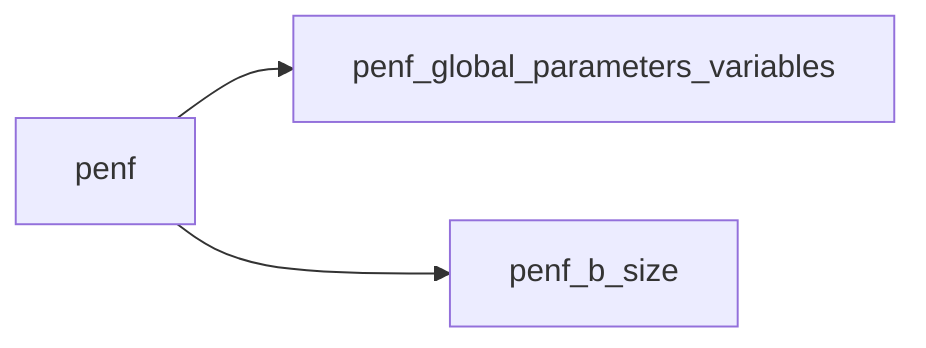
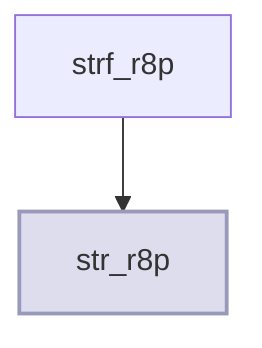

# API Reference Generation

## Pipeline

```
Fortran .F90 sources
    |  FORD parser
    v
FORD Project (modules, types, procedures, variables)
    |  FORMAL generator
    v
docs/api/*.md + _sidebar.json
    |  VitePress build
    v
Static HTML site
```

## What FORD Does

FORD (Fortran Documenter) reads `.F90` files and builds a structured object model:
- Each `module` becomes a `FortranModule` with lists of types, variables, subroutines, functions
- Each `type` has components (variables) and type-bound procedures
- Each subroutine/function has argument lists with types and intents
- Doc comments (`!<` by default) are attached as `doc_list` (raw Markdown strings)

FORMAL calls FORD's `Project()` + `correlate()` to build this model, then walks it to generate Markdown. It never calls FORD's HTML renderer.

## What FORMAL Generates Per Module

```markdown
---
title: module_name
---
# module_name
> Module description from doc comments

**Source**: `src/lib/common/module_name.F90`

## Variables
| Name | Type | Attributes | Description |

## Derived Types
### type_name
> Type description
#### Components
| Name | Type | Attributes | Description |
#### Type-Bound Procedures
| Name | Attributes | Description |

## Interfaces

## Subroutines
### sub_name
> Subroutine description
```fortran
subroutine sub_name(arg1, arg2)
`` `
**Arguments**
| Name | Type | Intent | Attributes | Description |

## Functions
```

## The FORD Project File

The FORD project file (`doc/formal.md` by default) tells FORD where to find your sources. It's a Markdown file with a metadata header:

```
project: MyProject
src_dir: ../src/lib
         ../src/app
exclude_dir: ../src/third_party/
docmark: <
display: public
         protected
         private
source: false
warn: true
graph: false
author: Jane Doe

This text after the metadata is the project description (unused by FORMAL).
```

### Key Settings

| Setting | Description | FORMAL default |
|---------|-------------|----------------|
| `src_dir` | Directories to scan for `.F90` files | Auto-detected from `src/` |
| `exclude_dir` | Directories to skip | Auto-detected (`third_party/`, etc.) |
| `docmark` | Doc comment marker (`<` means `!<`) | `<` |
| `display` | Which visibility to include | `public protected private` |
| `source` | Include source code in output | `false` (not needed for VitePress) |
| `graph` | Generate dependency graphs | `false` (speeds up parsing) |
| `warn` | Print warnings for undocumented entities | `true` |

### Adding Source Directories

To cover more code, add paths to `src_dir` (relative to the FORD project file):

```
src_dir: ../src/lib
         ../src/app
         ../src/plugins        # <-- add new directories here
```

### Excluding Directories

```
exclude_dir: ../src/third_party/
             ../src/generated/
             ../src/deprecated/
```

## Mirrored Source Layout

By default all generated pages land flat inside `docs/api/`. Passing `--mirror-sources` reproduces the Fortran source directory tree inside the output directory:

```bash
formal generate --mirror-sources
```

| Without `--mirror-sources` | With `--mirror-sources` |
|----------------------------|-------------------------|
| `api/my_module.md` | `api/src/lib/my_module.md` |
| `api/other_module.md` | `api/src/app/other_module.md` |

Sidebar links and cross-reference URLs are updated automatically to match. The sidebar groups also switch from human-readable labels to real directory paths (see [Sidebar → Mirroring Source Directory Structure](./sidebar#mirroring-source-directory-structure)).

## Mermaid Diagrams

Passing `--diagrams` embeds Mermaid diagram blocks in every generated page:

```bash
formal generate --diagrams
# or combine both flags:
formal generate --mirror-sources --diagrams
```

Three diagram types are generated from data already present in FORD's correlated object model:

| Diagram | Where it appears | Source data |
|---------|-----------------|-------------|
| **Dependency graph** | Module page, below the source path | `module.uses` |
| **Inheritance diagram** | Each derived type section | `type.extends` + child types |
| **Call graph** | Each subroutine/function section | `proc.calls` + inverse lookup |

Example dependency diagram in Markdown:

````markdown
**Dependencies**


````

Example call graph showing callers (inbound) and callees (outbound), with the current procedure highlighted:

````markdown
**Call graph**


````

### Enabling Mermaid in VitePress

Diagrams require `vitepress-plugin-mermaid`. For **new projects**, pass `--mermaid` to `formal init` and it is wired up automatically:

```bash
formal init --mermaid
cd docs && npm install
formal generate --diagrams
```

For an **existing site**, install manually and wrap the config:

```bash
npm i vitepress-plugin-mermaid mermaid -D
```

```typescript
// .vitepress/config.mts
import { withMermaid } from 'vitepress-plugin-mermaid'  // replace defineConfig import
import apiSidebar from '../api/_sidebar.json'

export default withMermaid({           // replace defineConfig(
  // ... your existing config unchanged ...
  mermaid: {},
})
```

## Customizing API Output

FORMAL's generator is in `src/formal/generator.py`. The formatting functions are modular and can be modified independently:

| Function | What it controls |
|----------|-----------------|
| `format_module()` | Overall page layout per module |
| `format_type()` | Derived type sections |
| `format_procedure()` | Subroutine/function sections |
| `format_variable_table()` | Variable/argument tables |
| `format_bound_proc_table()` | Type-bound procedure tables |
| `format_interface()` | Interface sections |
| `generate_sidebar()` | Sidebar grouping logic |
| `_classify_module()` | How modules map to sidebar groups (default mode) |
| `format_dependency_diagram()` | Module dependency graph block |
| `format_inheritance_diagram()` | Type inheritance diagram block |
| `format_call_diagram()` | Procedure call graph block |
| `build_called_by_index()` | Project-wide callee→callers mapping |
| `build_type_children_index()` | Project-wide parent→children type mapping |
| `inline_doc()` | How doc comments appear in table cells |
| `format_doc()` | How doc comments appear in block content |

### Sidebar Grouping

By default, `_classify_module()` groups modules by their source path:
- `src/app/<name>/...` → `Applications / NAME`
- `src/lib/<name>/...` → `Library / name`
- Other paths → grouped by first two directory components

With `--mirror-sources`, the group name is the raw source directory path (e.g. `src/lib`, `src/tests`). To change grouping in default mode, override `_classify_module()` or post-process the sidebar JSON after generation.

## Programmatic Usage

You can also use FORMAL as a library:

```python
from pathlib import Path
from formal.generator import generate

result = generate(
    project_file=Path("doc/formal.md"),
    output_dir=Path("docs/api"),
    mirror_sources=True,   # mirror source tree in output
    diagrams=True,         # embed Mermaid diagrams
    verbose=True,
)
print(f"Generated {result['modules']} module pages")
print(f"Sidebar groups: {[g['text'] for g in result['sidebar']]}")
```
